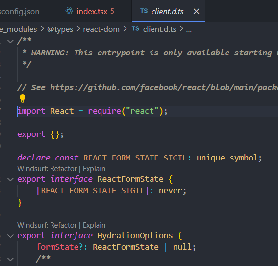

npx create-react-app . 

npm i @types/node @types/react @types/react-dom @types/jest

index.jsx --> index.tsx 로 변경하면, 오류가 발생한다.

------------------------------------------------------------------
오류1 : index.jsx에 가보면, react, react-dom 의 경우 export default가 없다.
이런 경우 tsconfig의 설정에 "esModuleInterop": true 추가해주면 된다.

보통은 "esModuleInterop": true 옵션을 켜놓고 개발한다고 생각하면 된다.

------------------------------------------------------------------
오류2 : '--jsx' 플래그를 제공하지 않으면 JSX를 사용할 수 없습니다.

"jsx": "react-jsx"를 추가해준다.

------------------------------------------------------------------
오류3 : 'HTMLElement | null' 형식의 인수는 'Container' 형식의 매개 변수에 할당될 수 없습니다.   'null' 형식은 'Container' 형식에 할당할 수 없습니다.

const root = ReactDOM.createRoot(document.getElementById('root'));

document.getElementById('root') 가 null이 될 수 있는데,
ReactDOM.createRoot메서드는 null 타입의 값을 인수로 받지 않기 때문에 오류가 발생한다.

document.getElementById('root') as HTMLElement
또는 
document.getElementById('root')!

------------------------------------------------------------------

